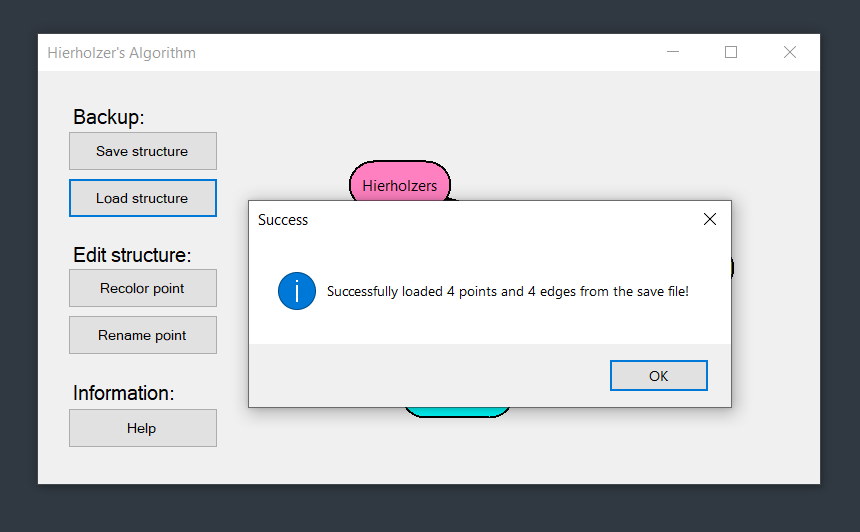

<br>

<h1 align="center">
  HierholzersAlgorithm
</h1>

---

This project gives a playfield for creating some simple clusters.
The user can create cluster points and connect them with edges.

---

## Features

- Creation and deletion of cluster points
- Connecting cluster points with edged
- Saving the currently displayed structure
- Loading a previously saved structe from a save file
- Changing cluster points name and color

## How to Run

1. Clone this repository:
   ```bash git clone https://github.com/mLoDar/HierholzersAlgorithm.git```

2. Open the solution file `(.sln)` in Visual Studio.

3. Build the project and run it.

## Screenshots

<p align="center">
    
    <br>
    <br>
    
    <br>
    <br>
    
</p>

---

<p align="center">
    <i>
        Feel free to submit pull requests or issues!
    </i>
</p>